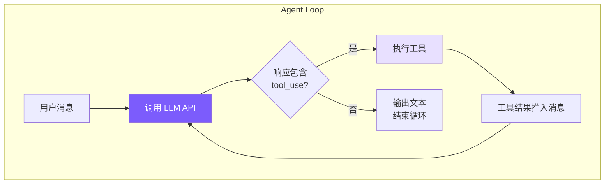

# 1. Agent Loop — 核心循环

## 本章目标

实现 coding agent 的心脏：一个 while 循环，不断调用 LLM → 检查是否需要执行工具 → 执行工具 → 把结果喂回 LLM → 重复，直到 LLM 认为任务完成。



## Claude Code 怎么做的

Claude Code 的 Agent Loop 分布在两层架构中：

### QueryEngine（会话级） — `src/QueryEngine.ts`

QueryEngine 管理整个会话的生命周期，持有消息历史、工具列表、token 统计等状态。它提供 `query()` 方法发起一轮对话。

### queryLoop（单轮级） — `src/query.ts:241`

`queryLoop` 是一个 **async generator**，每次 yield 一个事件（文本块、工具调用、工具结果等）。它处理 7 种 continue reason：

```typescript
// Claude Code 的 queryLoop 简化逻辑
async function* queryLoop(params) {
  while (true) {
    const response = yield* streamResponse(params);

    // 7 种 continue reason 决定是否继续循环
    if (response.stopReason === "end_turn") break;
    if (response.stopReason === "tool_use") {
      const results = yield* executeTools(response.toolUses);
      params.messages.push(...results);
      continue;
    }
    if (response.stopReason === "max_tokens") {
      // 自动继续生成
      continue;
    }
    // ... 还有 stop_sequence, content_filter 等
  }
}
```

关键设计：

- **State 对象**在迭代间传递，包含 `messages`、`tools`、`abortController` 等
- **事件系统**：通过 yield 向上层传递各种事件，UI 层订阅渲染
- **StreamingToolExecutor**：并发执行多个工具调用，按原始顺序返回结果

## 我们的实现

我们把两层架构合并成一个 `Agent` 类，核心是 `chatAnthropic()` 方法：

```typescript
// agent.ts — chatAnthropic 方法（核心 Agent Loop）

private async chatAnthropic(userMessage: string): Promise<void> {
  // 1. 用户消息推入历史
  this.anthropicMessages.push({ role: "user", content: userMessage });

  while (true) {
    // 中断检查
    if (this.abortController?.signal.aborted) break;

    // 2. 调用 API（带流式输出）
    const response = await this.callAnthropicStream();

    // 3. 统计 token 用量
    this.totalInputTokens += response.usage.input_tokens;
    this.totalOutputTokens += response.usage.output_tokens;
    this.lastInputTokenCount = response.usage.input_tokens;

    // 4. 提取所有 tool_use block
    const toolUses: Anthropic.ToolUseBlock[] = [];
    for (const block of response.content) {
      if (block.type === "tool_use") {
        toolUses.push(block);
      }
    }

    // 5. 整个 assistant 响应推入历史
    this.anthropicMessages.push({
      role: "assistant",
      content: response.content,
    });

    // 6. 终止条件：没有工具调用 → 任务完成
    if (toolUses.length === 0) {
      printCost(this.totalInputTokens, this.totalOutputTokens);
      break;  // ← 这就是循环的出口
    }

    // 7. 执行每个工具调用
    const toolResults: Anthropic.ToolResultBlockParam[] = [];
    for (const toolUse of toolUses) {
      if (this.abortController?.signal.aborted) break;

      const input = toolUse.input as Record<string, any>;
      printToolCall(toolUse.name, input);

      // 权限检查（详见第 5 章）
      if (!this.yolo) {
        const confirmMsg = needsConfirmation(toolUse.name, input);
        if (confirmMsg && !this.confirmedPaths.has(confirmMsg)) {
          const confirmed = await this.confirmDangerous(confirmMsg);
          if (!confirmed) {
            toolResults.push({
              type: "tool_result",
              tool_use_id: toolUse.id,
              content: "User denied this action.",
            });
            continue;  // 跳过被拒绝的工具
          }
          this.confirmedPaths.add(confirmMsg);
        }
      }

      // 执行工具并收集结果
      const result = await executeTool(toolUse.name, input);
      printToolResult(toolUse.name, result);
      toolResults.push({
        type: "tool_result",
        tool_use_id: toolUse.id,
        content: result,
      });
    }

    // 8. 工具结果作为 user 消息推入（Anthropic API 要求）
    this.anthropicMessages.push({ role: "user", content: toolResults });

    // 9. 检查是否需要压缩上下文（详见第 6 章）
    await this.checkAndCompact();
  }
  // 循环结束 → 回到 chat()，打印分隔线，自动保存会话
}
```

### 消息流转的关键

理解 Agent Loop 的关键在于理解**消息数组是如何增长的**：

```
初始状态:
  messages = []

第 1 轮:
  messages = [
    { role: "user", content: "帮我修复 bug" },                    ← 用户输入
    { role: "assistant", content: [text + tool_use(read_file)] },  ← LLM 响应
    { role: "user", content: [tool_result("文件内容...")] },       ← 工具结果
  ]

第 2 轮（LLM 看到文件内容后决定编辑）:
  messages = [
    ...前 3 条,
    { role: "assistant", content: [text + tool_use(edit_file)] },  ← LLM 再次响应
    { role: "user", content: [tool_result("编辑成功")] },          ← 工具结果
  ]

第 3 轮（LLM 认为任务完成）:
  messages = [
    ...前 5 条,
    { role: "assistant", content: [text("已修复!")] },             ← 纯文本，无 tool_use
  ]
  → toolUses.length === 0 → break!
```

### AbortController：优雅中断

Agent 通过 `AbortController` 支持 Ctrl+C 中断：

```typescript
// chat() 入口设置 AbortController
async chat(userMessage: string): Promise<void> {
  this.abortController = new AbortController();
  try {
    await this.chatAnthropic(userMessage);
  } finally {
    this.abortController = null;  // 重置，标记处理完成
  }
}

// 外部调用 abort()
abort() {
  this.abortController?.abort();
}

// 循环内检查中断信号
while (true) {
  if (this.abortController?.signal.aborted) break;
  // ...
}
```

`signal` 同时传递给 API 调用，确保网络请求也能被中断。

### chat() 入口方法

`chat()` 是外部调用的唯一入口，它做三件事：

```typescript
async chat(userMessage: string): Promise<void> {
  this.abortController = new AbortController();
  try {
    if (this.useOpenAI) {
      await this.chatOpenAI(userMessage);    // OpenAI 兼容后端
    } else {
      await this.chatAnthropic(userMessage); // Anthropic 原生后端
    }
  } finally {
    this.abortController = null;
  }
  printDivider();    // 打印分隔线
  this.autoSave();   // 自动保存会话
}
```

## 简化对比

| 维度 | Claude Code | mini-claude |
|------|------------|-------------|
| **循环结构** | async generator（yield 事件） | 简单 while(true) 循环 |
| **架构层次** | QueryEngine + queryLoop 两层 | 单个 Agent 类 |
| **Continue Reason** | 7 种（tool_use, max_tokens, end_turn...） | 只检查 tool_use |
| **状态管理** | State 对象在函数间传递 | class 成员变量 |
| **事件系统** | yield 事件 → UI 订阅 | 直接 `console` 输出 |
| **工具执行** | StreamingToolExecutor 并发 | 串行 for 循环 |
| **中断支持** | AbortController + 事件 | AbortController（相同） |
| **代码量** | ~2000 行（query.ts + QueryEngine.ts） | ~70 行（chatAnthropic） |

最关键的简化是**把 async generator 换成 while 循环**。Claude Code 使用 generator 是为了把循环内部的每一步都作为事件 yield 出去，供 React/Ink UI 订阅渲染。我们直接在循环里 `console.log`，不需要这层抽象。

---

> **下一章**：循环的核心动力是工具——没有工具，LLM 只是一个聊天机器人。我们来看工具系统的实现。
