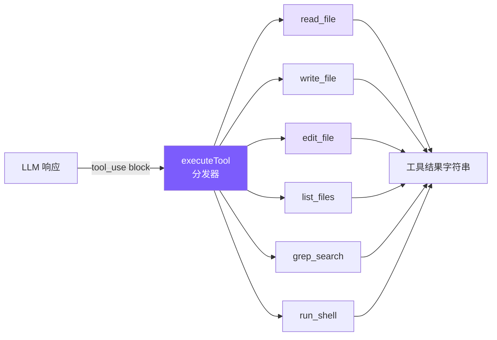

# 2. 工具系统

## 本章目标

定义 6 个核心工具（读文件、写文件、编辑文件、列文件、搜索、Shell），让 LLM 能真正操作你的代码库。



## Claude Code 怎么做的

Claude Code 的工具系统是一个重度抽象的类体系：

### Tool 抽象类 — `src/Tool.ts`

每个工具继承 `Tool` 抽象类，实现 4 个方法：

```typescript
abstract class Tool {
  abstract description(): string;          // 工具描述
  abstract prompt(): Promise<string>;      // 动态 prompt（可含上下文）
  abstract validateInput(input): boolean;  // 输入校验
  abstract call(input, context): Promise<ToolResult>;  // 执行
}
```

### 工具注册 — `src/tools.ts`

66+ 工具在 `tools.ts` 中注册，每个工具一个独立目录：

```
src/tools/
  BashTool/        — Shell 命令（含 AST 安全分析）
  FileReadTool/    — 读文件（支持行范围、PDF、图片）
  FileEditTool/    — 编辑文件（精确匹配替换）
  FileWriteTool/   — 写文件
  GlobTool/        — 文件搜索
  GrepTool/        — 内容搜索
  AgentTool/       — 子代理
  NotebookEditTool/ — Jupyter 编辑
  ... 共 66+ 工具
```

### StreamingToolExecutor

当 LLM 一次返回多个 tool_use，Claude Code 使用 `StreamingToolExecutor` 并发执行，但按原始顺序返回结果：

```typescript
// 并发执行，顺序返回
const executor = new StreamingToolExecutor(toolCalls);
for await (const result of executor) {
  yield result; // 按原始 index 顺序
}
```

## 我们的实现

我们把 66 个工具类简化为 **1 个文件 + 6 个函数**。

### 工具定义：静态数组

```typescript
// tools.ts — 工具定义（Anthropic Tool schema 格式）

export const toolDefinitions: ToolDef[] = [
  {
    name: "read_file",
    description: "Read the contents of a file. Returns the file content with line numbers.",
    input_schema: {
      type: "object",
      properties: {
        file_path: { type: "string", description: "The path to the file to read" },
      },
      required: ["file_path"],
    },
  },
  {
    name: "write_file",
    description: "Write content to a file. Creates the file if it doesn't exist, overwrites if it does.",
    input_schema: {
      type: "object",
      properties: {
        file_path: { type: "string", description: "The path to the file to write" },
        content: { type: "string", description: "The content to write to the file" },
      },
      required: ["file_path", "content"],
    },
  },
  {
    name: "edit_file",
    description: "Edit a file by replacing an exact string match with new content. The old_string must match exactly.",
    input_schema: {
      type: "object",
      properties: {
        file_path: { type: "string", description: "The path to the file to edit" },
        old_string: { type: "string", description: "The exact string to find and replace" },
        new_string: { type: "string", description: "The string to replace it with" },
      },
      required: ["file_path", "old_string", "new_string"],
    },
  },
  // ... list_files, grep_search, run_shell
];
```

这些定义直接传给 Anthropic API 的 `tools` 参数——格式完全一致，不需要任何转换。

### 工具执行：switch 分发器

```typescript
// tools.ts — executeTool

export async function executeTool(
  name: string,
  input: Record<string, any>
): Promise<string> {
  let result: string;
  switch (name) {
    case "read_file":
      result = readFile(input as { file_path: string });
      break;
    case "write_file":
      result = writeFile(input as { file_path: string; content: string });
      break;
    case "edit_file":
      result = editFile(input as { file_path: string; old_string: string; new_string: string });
      break;
    case "list_files":
      result = await listFiles(input as { pattern: string; path?: string });
      break;
    case "grep_search":
      result = grepSearch(input as { pattern: string; path?: string; include?: string });
      break;
    case "run_shell":
      result = runShell(input as { command: string; timeout?: number });
      break;
    default:
      return `Unknown tool: ${name}`;
  }
  return truncateResult(result);  // ← 50K 字符保护
}
```

### 逐个工具详解

#### read_file — 读文件

```typescript
function readFile(input: { file_path: string }): string {
  try {
    const content = readFileSync(input.file_path, "utf-8");
    const lines = content.split("\n");
    const numbered = lines
      .map((line, i) => `${String(i + 1).padStart(4)} | ${line}`)
      .join("\n");
    return numbered;
  } catch (e: any) {
    return `Error reading file: ${e.message}`;
  }
}
```

**为什么加行号？** 因为 `edit_file` 需要精确匹配。行号帮助 LLM 定位代码位置，但匹配时用的是实际内容字符串，不是行号。Claude Code 的 `FileReadTool` 也返回带行号的内容，格式略有不同（`cat -n` 风格）。

#### edit_file — 编辑文件（最关键的工具）

```typescript
function editFile(input: {
  file_path: string;
  old_string: string;
  new_string: string;
}): string {
  try {
    const content = readFileSync(input.file_path, "utf-8");

    // 关键：唯一匹配检查
    const count = content.split(input.old_string).length - 1;
    if (count === 0)
      return `Error: old_string not found in ${input.file_path}`;
    if (count > 1)
      return `Error: old_string found ${count} times. Must be unique.`;

    const newContent = content.replace(input.old_string, input.new_string);
    writeFileSync(input.file_path, newContent);
    return `Successfully edited ${input.file_path}`;
  } catch (e: any) {
    return `Error editing file: ${e.message}`;
  }
}
```

**唯一匹配检查**是 edit_file 的核心设计。Claude Code 的 `FileEditTool` 用同样的策略——`old_string` 必须在文件中恰好出现一次。如果出现 0 次（找不到）或 >1 次（歧义），都拒绝执行。

这比"按行号编辑"更可靠：行号在多步编辑中会变化，但字符串内容不会歧义。

#### write_file — 写文件

```typescript
function writeFile(input: { file_path: string; content: string }): string {
  try {
    const dir = dirname(input.file_path);
    if (!existsSync(dir)) mkdirSync(dir, { recursive: true });  // 自动创建目录
    writeFileSync(input.file_path, input.content);
    return `Successfully wrote to ${input.file_path}`;
  } catch (e: any) {
    return `Error writing file: ${e.message}`;
  }
}
```

System Prompt 里我们告诉 LLM"优先用 edit_file，只对新文件用 write_file"——这和 Claude Code 的策略一致。

#### grep_search — 搜索

```typescript
function grepSearch(input: {
  pattern: string;
  path?: string;
  include?: string;
}): string {
  try {
    const args = ["--line-number", "--color=never", "-r"];
    if (input.include) args.push(`--include=${input.include}`);
    args.push(input.pattern);
    args.push(input.path || ".");
    const result = execSync(`grep ${args.join(" ")}`, {
      encoding: "utf-8",
      maxBuffer: 1024 * 1024,
      timeout: 10000,
    });
    const lines = result.split("\n").filter(Boolean);
    return lines.slice(0, 100).join("\n") +
      (lines.length > 100 ? `\n... and ${lines.length - 100} more matches` : "");
  } catch (e: any) {
    if (e.status === 1) return "No matches found.";
    return `Error: ${e.message}`;
  }
}
```

Claude Code 使用 ripgrep (`rg`)，我们用系统自带的 `grep` —— 功能够用，少一个依赖。

#### run_shell — Shell 命令

```typescript
function runShell(input: { command: string; timeout?: number }): string {
  try {
    const result = execSync(input.command, {
      encoding: "utf-8",
      maxBuffer: 5 * 1024 * 1024,
      timeout: input.timeout || 30000,
      stdio: ["pipe", "pipe", "pipe"],
    });
    return result || "(no output)";
  } catch (e: any) {
    const stderr = e.stderr ? `\nStderr: ${e.stderr}` : "";
    const stdout = e.stdout ? `\nStdout: ${e.stdout}` : "";
    return `Command failed (exit code ${e.status})${stdout}${stderr}`;
  }
}
```

Claude Code 的 `BashTool` 有一整套安全机制（AST 解析命令、沙箱执行），我们只做了基础的 timeout 保护和危险命令检测（详见第 5 章）。

### 工具结果截断：第一道防线

```typescript
const MAX_RESULT_CHARS = 50000;

function truncateResult(result: string): string {
  if (result.length <= MAX_RESULT_CHARS) return result;
  const keepEach = Math.floor((MAX_RESULT_CHARS - 60) / 2);
  return (
    result.slice(0, keepEach) +
    "\n\n[... truncated " + (result.length - keepEach * 2) + " chars ...]\n\n" +
    result.slice(-keepEach)
  );
}
```

为什么保留头尾而不只保留头部？因为很多命令的关键输出在末尾（比如编译错误、测试结果摘要）。

## 简化对比

| 维度 | Claude Code | mini-claude |
|------|------------|-------------|
| **工具数量** | 66+ | 6 |
| **工具定义** | 每个是一个 class，有 4 个方法 | 静态 JSON schema 数组 |
| **工具分发** | 注册表 + 依赖注入 | switch 语句 |
| **执行模式** | StreamingToolExecutor 并发 | 串行 for 循环 |
| **搜索引擎** | ripgrep（rg） | 系统 grep |
| **Shell 安全** | AST 解析 + 沙箱 | 正则匹配 + 确认 |
| **结果截断** | 选择性裁剪 | 保留头尾 50K |
| **代码量** | ~10000 行（所有工具） | ~325 行 |

---

> **下一章**：工具定义了 agent 的能力，但 System Prompt 定义了它的行为——怎么用这些工具、什么时候该小心。
