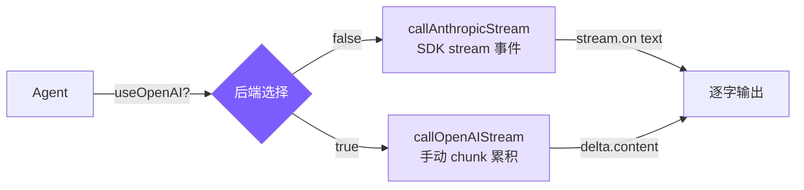

# 4. 流式输出与双后端

## 本章目标

实现流式输出让回答逐字显示，并支持 Anthropic 和 OpenAI 两套 API 后端。



## Claude Code 怎么做的

Claude Code 使用 SSE (Server-Sent Events) streaming，深度集成在 query loop 的 async generator 中：

```typescript
// src/services/api/claude.ts — 简化
async function* streamResponse(params) {
  const stream = client.messages.stream(params);
  for await (const event of stream) {
    yield event; // 每个事件向上 yield → React/Ink UI 渲染
  }
}
```

事件类型包括：`message_start`, `content_block_start`, `content_block_delta`（文本或工具参数的增量），`message_stop` 等。UI 层订阅这些事件，实时更新终端显示。

## 我们的实现

### Anthropic 后端：SDK 内置 stream

Anthropic SDK 提供了优雅的 stream API：

```typescript
// agent.ts — callAnthropicStream

private async callAnthropicStream(): Promise<Anthropic.Message> {
  return withRetry(async (signal) => {
    const createParams: any = {
      model: this.model,
      max_tokens: this.thinkingMode !== "disabled" ? maxOutput : 16384,
      system: this.systemPrompt,
      tools: toolDefinitions,
      messages: this.anthropicMessages,
    };

    // Extended Thinking 支持（三种模式：adaptive / enabled / disabled）
    if (this.thinkingMode === "enabled") {
      createParams.thinking = { type: "enabled", budget_tokens: maxOutput - 1 };
    } else if (this.thinkingMode === "adaptive") {
      createParams.thinking = { type: "enabled", budget_tokens: 10000 };
    }

    // 创建流
    const stream = this.anthropicClient!.messages.stream(
      createParams,
      { signal }  // ← AbortController signal，支持 Ctrl+C 中断
    );

    // 监听文本事件，逐字输出
    let firstText = true;
    stream.on("text", (text) => {
      if (firstText) { printAssistantText("\n"); firstText = false; }
      printAssistantText(text);
    });

    // 等待完整响应
    const finalMessage = await stream.finalMessage();

    // 过滤 thinking blocks（不存入历史）
    if (this.thinkingMode !== "disabled") {
      finalMessage.content = finalMessage.content.filter(
        (block: any) => block.type !== "thinking"
      );
    }

    return finalMessage;
  }, this.abortController?.signal);
}
```

关键点：

1. **`stream.on("text")`**：SDK 自动解析 SSE 事件，只给我们文本增量
2. **`stream.finalMessage()`**：流结束后返回完整的 `Message` 对象，包含所有 content blocks 和 usage 统计
3. **`{ signal }`**：把 AbortController 的 signal 传给 SDK，用户按 Ctrl+C 时能中断网络请求

### OpenAI 兼容后端：手动 chunk 累积

OpenAI 的 streaming 协议不同——tool_calls 的参数是分 chunk 到达的，需要手动累积重建：

```typescript
// agent.ts — callOpenAIStream

private async callOpenAIStream(): Promise<OpenAI.ChatCompletion> {
  return withRetry(async (signal) => {
    const stream = await this.openaiClient!.chat.completions.create({
      model: this.model,
      max_tokens: 16384,
      tools: toOpenAITools(),
      messages: this.openaiMessages,
      stream: true,
      stream_options: { include_usage: true },  // 请求 usage 统计
    }, { signal });

    // 累积变量
    let content = "";
    let firstText = true;
    const toolCalls: Map<number, { id: string; name: string; arguments: string }> = new Map();
    let finishReason = "";
    let usage: { prompt_tokens: number; completion_tokens: number } | undefined;

    for await (const chunk of stream) {
      const delta = chunk.choices[0]?.delta;

      // Usage 在最后一个 chunk 中（没有 delta）
      if (chunk.usage) {
        usage = {
          prompt_tokens: chunk.usage.prompt_tokens,
          completion_tokens: chunk.usage.completion_tokens,
        };
      }

      if (!delta) continue;

      // 流式输出文本
      if (delta.content) {
        if (firstText) { printAssistantText("\n"); firstText = false; }
        printAssistantText(delta.content);
        content += delta.content;
      }

      // 累积 tool_calls（参数分 chunk 到达）
      if (delta.tool_calls) {
        for (const tc of delta.tool_calls) {
          const existing = toolCalls.get(tc.index);
          if (existing) {
            // 已有的 tool_call，追加 arguments 片段
            if (tc.function?.arguments)
              existing.arguments += tc.function.arguments;
          } else {
            // 新 tool_call，初始化
            toolCalls.set(tc.index, {
              id: tc.id || "",
              name: tc.function?.name || "",
              arguments: tc.function?.arguments || "",
            });
          }
        }
      }

      if (chunk.choices[0]?.finish_reason) {
        finishReason = chunk.choices[0].finish_reason;
      }
    }

    // 从 chunks 重建完整的 ChatCompletion 对象
    const assembledToolCalls = toolCalls.size > 0
      ? Array.from(toolCalls.entries())
          .sort(([a], [b]) => a - b)   // 按 index 排序
          .map(([idx, tc]) => ({
            id: tc.id,
            type: "function" as const,
            function: { name: tc.name, arguments: tc.arguments },
          }))
      : undefined;

    return {
      id: "stream",
      object: "chat.completion",
      created: Date.now(),
      model: this.model,
      choices: [{
        index: 0,
        message: {
          role: "assistant" as const,
          content: content || null,
          tool_calls: assembledToolCalls,
          refusal: null,
        },
        finish_reason: finishReason || "stop",
        logprobs: null,
      }],
      usage: usage || { prompt_tokens: 0, completion_tokens: 0, total_tokens: 0 },
    } as OpenAI.ChatCompletion;
  }, this.abortController?.signal);
}
```

#### OpenAI tool_calls 的 delta 累积模式

这是 OpenAI streaming 最复杂的部分。tool_calls 的参数不是一次性发送的：

```
chunk 1: delta.tool_calls = [{ index: 0, id: "call_abc", function: { name: "read_file", arguments: '{"fi' } }]
chunk 2: delta.tool_calls = [{ index: 0, function: { arguments: 'le_path":' } }]
chunk 3: delta.tool_calls = [{ index: 0, function: { arguments: ' "src/a' } }]
chunk 4: delta.tool_calls = [{ index: 0, function: { arguments: 'gent.ts"}' } }]
```

我们用 `Map<index, accumulated>` 来追踪每个 tool_call 的累积状态。`index` 字段标识哪个 tool_call（一次可能有多个并发 tool_calls）。

### 工具格式转换

Anthropic 和 OpenAI 的工具定义格式不同：

```typescript
// 将 Anthropic 格式转为 OpenAI 格式
function toOpenAITools(): OpenAI.ChatCompletionTool[] {
  return toolDefinitions.map((t) => ({
    type: "function" as const,
    function: {
      name: t.name,
      description: t.description,
      parameters: t.input_schema as Record<string, unknown>,
    },
  }));
}
```

Anthropic 用 `input_schema`，OpenAI 用 `parameters`——内容相同，字段名不同。

### 重试机制：withRetry

API 调用可能因为限流、过载等原因失败，我们用指数退避重试：

```typescript
function isRetryable(error: any): boolean {
  const status = error?.status || error?.statusCode;
  if ([429, 503, 529].includes(status)) return true;  // 限流、服务不可用
  if (error?.code === "ECONNRESET" || error?.code === "ETIMEDOUT") return true;
  if (error?.message?.includes("overloaded")) return true;
  return false;
}

async function withRetry<T>(
  fn: (signal?: AbortSignal) => Promise<T>,
  signal?: AbortSignal,
  maxRetries = 3
): Promise<T> {
  for (let attempt = 0; ; attempt++) {
    try {
      return await fn(signal);
    } catch (error: any) {
      if (signal?.aborted) throw error;  // 用户中断，不重试
      if (attempt >= maxRetries || !isRetryable(error)) throw error;
      const delay = Math.min(1000 * Math.pow(2, attempt), 30000)
                  + Math.random() * 1000;  // 指数退避 + 随机抖动
      const reason = error?.status ? `HTTP ${error.status}` : error?.code || "network error";
      printRetry(attempt + 1, maxRetries, reason);
      await new Promise((r) => setTimeout(r, delay));
    }
  }
}
```

### Extended Thinking

Anthropic 独有的 Extended Thinking 让模型在回答前进行深度推理。我们支持三种模式：

- **adaptive**：4.6 模型（opus-4-6、sonnet-4-6）自动启用，budget 较小（10000 tokens）
- **enabled**：通过 `--thinking` flag 显式启用，budget 为 maxOutput - 1
- **disabled**：非 Claude 模型或 Claude 3.x 自动禁用

```typescript
// 模式判断
function resolveThinkingMode(model: string, thinkingFlag: boolean): "adaptive" | "enabled" | "disabled" {
  if (!modelSupportsThinking(model)) return "disabled";
  if (thinkingFlag) return "enabled";
  if (modelSupportsAdaptiveThinking(model)) return "adaptive";
  return "disabled";
}

// 构造参数时根据模式设置不同 budget
if (this.thinkingMode === "enabled") {
  createParams.thinking = { type: "enabled", budget_tokens: maxOutput - 1 };
} else if (this.thinkingMode === "adaptive") {
  createParams.thinking = { type: "enabled", budget_tokens: 10000 };
}

// 响应中过滤 thinking blocks（不存入历史，避免浪费上下文）
finalMessage.content = finalMessage.content.filter(
  (block: any) => block.type !== "thinking"
);
```

streaming 过程中 thinking 内容会以暗色显示，让用户看到模型的推理过程。

## 简化对比

| 维度 | Claude Code | mini-claude |
|------|------------|-------------|
| **流式协议** | SSE + async generator yield | SDK stream 事件 / 手动 chunk |
| **UI 渲染** | React/Ink TUI 组件 | 直接 `process.stdout.write` |
| **后端支持** | 仅 Anthropic | Anthropic + OpenAI 兼容 |
| **重试策略** | 类似指数退避 | 指数退避 + 随机抖动 |
| **Thinking** | 深度集成，UI 展示 | 基础支持，过滤 blocks |
| **代码量** | ~800 行（API 层） | ~200 行（两套 stream 方法） |

---

> **下一章**：agent 能操作文件和执行命令了，但我们需要防止它做危险的事——删除文件、执行 `rm -rf`、push 到 main 分支。
