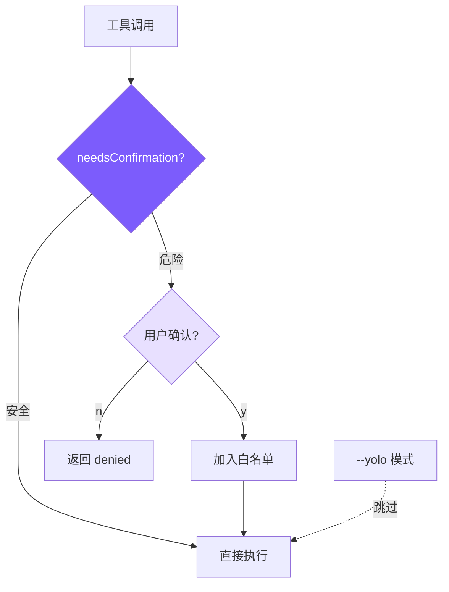

# 5. 权限与安全

## 本章目标

实现一个轻量但有效的安全机制：识别危险操作 → 向用户确认 → 记住已授权的操作。



## Claude Code 怎么做的

Claude Code 有一套 **5 层防御体系**：

### 1. System Prompt 层
在 prompt 中明确禁止特定行为（"NEVER run git push --force to main"）。

### 2. 权限模式
三种模式：`default`（正常确认）、`auto`（自动允许已配置的）、`bypass`（全跳过）。

### 3. BashTool AST 分析 — `src/tools/BashTool/`
对 shell 命令进行 AST 解析（不是正则），精确判断命令是否安全：

```typescript
// Claude Code 的 BashTool 安全检查（简化）
function analyzeCommand(cmd: string): SecurityAssessment {
  const ast = parseShellAST(cmd);  // 解析成 AST
  for (const node of ast.commands) {
    if (isDangerousCommand(node)) {
      return { level: "dangerous", reason: "..." };
    }
  }
  return { level: "safe" };
}
```

### 4. 危险模式库 — `src/utils/permissions/dangerousPatterns.ts`
维护一个详细的危险模式列表，每个模式有分类和说明。

### 5. 权限配置文件
持久化的权限配置，让用户可以预先授权某些操作。

完整的权限系统在 `src/utils/permissions/permissions.ts` 中，**52KB 一个文件**。

## 我们的实现

我们把 5 层简化为 **3 个组件**：

### 1. 危险命令检测：10 个正则

```typescript
// tools.ts — 危险命令模式

const DANGEROUS_PATTERNS = [
  /\brm\s/,                              // rm 删除
  /\bgit\s+(push|reset|clean|checkout\s+\.)/, // git 破坏性操作
  /\bsudo\b/,                             // 提权
  /\bmkfs\b/,                             // 格式化
  /\bdd\s/,                               // 磁盘操作
  />\s*\/dev\//,                           // 写设备文件
  /\bkill\b/,                             // 杀进程
  /\bpkill\b/,                            // 批量杀进程
  /\breboot\b/,                           // 重启
  /\bshutdown\b/,                         // 关机
];

export function isDangerous(command: string): boolean {
  return DANGEROUS_PATTERNS.some((p) => p.test(command));
}
```

### 2. 统一权限检查：needsConfirmation

```typescript
// tools.ts — needsConfirmation

export function needsConfirmation(
  toolName: string,
  input: Record<string, any>
): string | null {
  // Shell 命令：检查危险模式
  if (toolName === "run_shell" && isDangerous(input.command)) {
    return input.command;  // 返回命令内容作为确认信息
  }
  // 写新文件需要确认
  if (toolName === "write_file" && !existsSync(input.file_path)) {
    return `write new file: ${input.file_path}`;
  }
  // 编辑不存在的文件
  if (toolName === "edit_file" && !existsSync(input.file_path)) {
    return `edit non-existent file: ${input.file_path}`;
  }
  return null;  // 安全，不需要确认
}
```

设计决策：

- **`run_shell` + 危险模式** → 需要确认
- **`write_file` + 新文件** → 需要确认（防止创建意外文件）
- **`edit_file` + 不存在** → 需要确认（会失败，但给用户提示）
- **`read_file`、`list_files`、`grep_search`** → 永远安全，无需确认

### 3. 会话级白名单：confirmedPaths

在 Agent Loop 中，权限检查和白名单结合使用：

```typescript
// agent.ts — chatAnthropic 中的权限检查

// Agent 类成员
private confirmedPaths: Set<string> = new Set();

// 在工具执行前检查
if (!this.yolo) {
  const confirmMsg = needsConfirmation(toolUse.name, input);
  if (confirmMsg && !this.confirmedPaths.has(confirmMsg)) {
    // 弹出确认提示
    const confirmed = await this.confirmDangerous(confirmMsg);
    if (!confirmed) {
      toolResults.push({
        type: "tool_result",
        tool_use_id: toolUse.id,
        content: "User denied this action.",
      });
      continue;  // 跳过这个工具，但不中断整个循环
    }
    // 记住用户的授权
    this.confirmedPaths.add(confirmMsg);
  }
}
```

关键设计：

- **`confirmedPaths` 是 Set**：同一个操作只确认一次
- **"User denied" 作为工具结果**：而不是抛错或中断循环。LLM 看到 denied 后会调整策略
- **`--yolo` 跳过所有检查**：通过 `if (!this.yolo)` 实现

### 确认对话框的实现

```typescript
// agent.ts — confirmDangerous

private async confirmDangerous(command: string): Promise<boolean> {
  printConfirmation(command);  // "⚠ Dangerous command: rm -rf ..."
  const rl = readline.createInterface({
    input: process.stdin,
    output: process.stdout,
  });
  return new Promise((resolve) => {
    rl.question("  Allow? (y/n): ", (answer) => {
      rl.close();
      resolve(answer.toLowerCase().startsWith("y"));
    });
  });
}
```

用临时的 readline 接口实现，避免与 REPL 的 readline 冲突。

### --yolo 模式

```bash
mini-claude --yolo "delete all .tmp files and rebuild"
```

在 `Agent` 构造函数中：

```typescript
constructor(options: AgentOptions = {}) {
  this.yolo = options.yolo || false;
  // ...
}
```

`--yolo` 适合你完全信任 agent 的场景（比如在容器中运行、或者处理低风险任务）。

## 安全模型的局限性

我们的安全机制是**最低限度的**：

1. **正则匹配 vs AST 分析**：`rm -rf /` 能捕获，但 `find / -delete` 捕获不了
2. **没有沙箱**：命令在当前用户权限下执行
3. **没有持久化配置**：每次启动重新确认
4. **没有命令白名单**：不能预先授权 "npm test 永远允许"

这些都是 Claude Code 解决了但我们刻意省略的——对于教学目的和个人使用，这个安全级别够用了。

## 简化对比

| 维度 | Claude Code | mini-claude |
|------|------------|-------------|
| **防御层次** | 5 层 | 3 层 |
| **命令分析** | AST 解析 | 正则匹配 |
| **权限模式** | default / auto / bypass | 默认 / --yolo |
| **白名单** | 持久化配置文件 | 会话级 Set |
| **工具种类** | 每个工具有独立权限规则 | 3 种工具需要确认 |
| **沙箱** | 支持沙箱执行 | 无 |
| **代码量** | ~52KB（permissions.ts 一个文件） | ~40 行 |

---

> **下一章**：安全机制保护了系统边界，但还有一个内部边界需要管理——LLM 的上下文窗口。当对话太长时怎么办？
