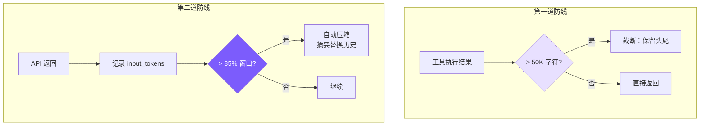

# 6. 上下文管理

## 本章目标

防止对话历史超出 LLM 的上下文窗口：在工具侧截断过长的结果，在对话侧自动压缩历史。



## Claude Code 怎么做的

Claude Code 在 `src/services/compact/` 中实现了一个 **4 级压缩流水线**：

1. **Token 计数**：精确计算每条消息的 token 数
2. **选择性裁剪**：优先移除早期的工具结果（保留工具调用摘要）
3. **缓存感知压缩**：保留 prompt cache 可以复用的部分
4. **摘要压缩**：调用 LLM 生成对话摘要，替换原始历史

触发机制是 `AutoCompactTrackingState`，在每次 API 返回后检查 token 用量。

## 我们的实现

### 第一道防线：truncateResult

在工具执行层面，防止单个工具结果撑爆上下文：

```typescript
// tools.ts — truncateResult

const MAX_RESULT_CHARS = 50000;

function truncateResult(result: string): string {
  if (result.length <= MAX_RESULT_CHARS) return result;
  const keepEach = Math.floor((MAX_RESULT_CHARS - 60) / 2);
  return (
    result.slice(0, keepEach) +
    "\n\n[... truncated " + (result.length - keepEach * 2) + " chars ...]\n\n" +
    result.slice(-keepEach)
  );
}
```

50K 字符大约对应 12K-15K tokens。为什么保留头尾？

- **头部**：文件开头通常有 imports、类定义等结构信息
- **尾部**：命令输出的错误摘要、测试结果通常在最后

### 第二道防线：自动压缩

#### 触发条件

```typescript
// agent.ts — checkAndCompact

private async checkAndCompact(): Promise<void> {
  if (this.lastInputTokenCount > this.effectiveWindow * 0.85) {
    printInfo("Context window filling up, compacting conversation...");
    await this.compactConversation();
  }
}
```

- **`effectiveWindow`** = 模型上下文窗口 - 20000（预留给新的输入/输出）
- **85% 阈值**：当输入 token 超过有效窗口的 85% 时触发
- **`lastInputTokenCount`**：每次 API 返回后更新

```typescript
// 在构造函数中计算
this.effectiveWindow = getContextWindow(this.model) - 20000;

// 上下文窗口配置
const MODEL_CONTEXT: Record<string, number> = {
  "claude-sonnet-4-20250514": 200000,
  "claude-haiku-4-20250414": 200000,
  "claude-opus-4-20250514": 200000,
  "gpt-4o": 128000,
  "gpt-4o-mini": 128000,
};
```

#### Anthropic 后端压缩

```typescript
// agent.ts — compactAnthropic

private async compactAnthropic(): Promise<void> {
  if (this.anthropicMessages.length < 4) return;  // 太短不值得压缩

  // 保留最后一条用户消息
  const lastUserMsg = this.anthropicMessages[this.anthropicMessages.length - 1];

  // 用 LLM 生成摘要
  const summaryResp = await this.anthropicClient!.messages.create({
    model: this.model,
    max_tokens: 2048,
    system: "You are a conversation summarizer. Be concise but preserve important details.",
    messages: [
      ...this.anthropicMessages.slice(0, -1),  // 除最后一条外的所有历史
      {
        role: "user",
        content: "Summarize the conversation so far in a concise paragraph, "
               + "preserving key decisions, file paths, and context needed to continue the work.",
      },
    ],
  });

  const summaryText = summaryResp.content[0]?.type === "text"
    ? summaryResp.content[0].text
    : "No summary available.";

  // 用摘要替换整个历史
  this.anthropicMessages = [
    {
      role: "user",
      content: `[Previous conversation summary]\n${summaryText}`,
    },
    {
      role: "assistant",
      content: "Understood. I have the context from our previous conversation. "
             + "How can I continue helping?",
    },
  ];

  // 恢复最后一条用户消息
  if (lastUserMsg.role === "user") {
    this.anthropicMessages.push(lastUserMsg);
  }

  this.lastInputTokenCount = 0;  // 重置计数
}
```

压缩后的消息数组从可能的几十条变成 2-3 条，大幅释放上下文空间。

#### OpenAI 后端压缩

逻辑相同，但要保留 system 消息（OpenAI 把 system prompt 放在消息数组中）：

```typescript
// agent.ts — compactOpenAI

private async compactOpenAI(): Promise<void> {
  if (this.openaiMessages.length < 5) return;

  const systemMsg = this.openaiMessages[0];  // 保留 system 消息
  const lastUserMsg = this.openaiMessages[this.openaiMessages.length - 1];

  const summaryResp = await this.openaiClient!.chat.completions.create({
    model: this.model,
    max_tokens: 2048,
    messages: [
      {
        role: "system",
        content: "You are a conversation summarizer. Be concise but preserve important details.",
      },
      ...this.openaiMessages.slice(1, -1),
      {
        role: "user",
        content: "Summarize the conversation so far...",
      },
    ],
  });

  const summaryText = summaryResp.choices[0]?.message?.content || "No summary available.";

  // 重建：system + summary + 最后的用户消息
  this.openaiMessages = [
    systemMsg,
    { role: "user", content: `[Previous conversation summary]\n${summaryText}` },
    { role: "assistant", content: "Understood. I have the context..." },
  ];

  if ((lastUserMsg as any).role === "user") {
    this.openaiMessages.push(lastUserMsg);
  }

  this.lastInputTokenCount = 0;
}
```

### 手动压缩

用户也可以通过 REPL 命令手动触发：

```
> /compact
  ℹ Conversation compacted.
```

调用链：`cli.ts` → `agent.compact()` → `compactConversation()` → `compactAnthropic()` / `compactOpenAI()`

### Token 统计

每次 API 调用后更新统计：

```typescript
// Anthropic
this.totalInputTokens += response.usage.input_tokens;
this.totalOutputTokens += response.usage.output_tokens;
this.lastInputTokenCount = response.usage.input_tokens;

// OpenAI
if (response.usage) {
  this.totalInputTokens += response.usage.prompt_tokens;
  this.totalOutputTokens += response.usage.completion_tokens;
  this.lastInputTokenCount = response.usage.prompt_tokens;
}
```

`lastInputTokenCount` 只记录最近一次的输入 token（用于判断是否接近窗口上限），而 `totalInputTokens` 累计所有调用（用于费用估算）。

## 简化对比

| 维度 | Claude Code | mini-claude |
|------|------------|-------------|
| **压缩层级** | 4 级流水线 | 2 层（截断 + 摘要） |
| **Token 计数** | 精确计数每条消息 | 使用 API 返回的 input_tokens |
| **触发机制** | AutoCompactTrackingState | 简单 85% 阈值 |
| **压缩策略** | 选择性裁剪 + 缓存感知 | 全量摘要替换 |
| **保留内容** | 工具调用摘要、关键决策 | 单段摘要 + 最后用户消息 |
| **手动触发** | 支持 | /compact 命令 |
| **结果截断** | 智能裁剪 | 保留头尾 50K |
| **代码量** | ~1000 行（compact 目录） | ~80 行 |

---

> **下一章**：底层引擎已经完成。最后我们来把它包装成一个好用的 CLI 工具——参数解析、REPL 交互、会话持久化。
