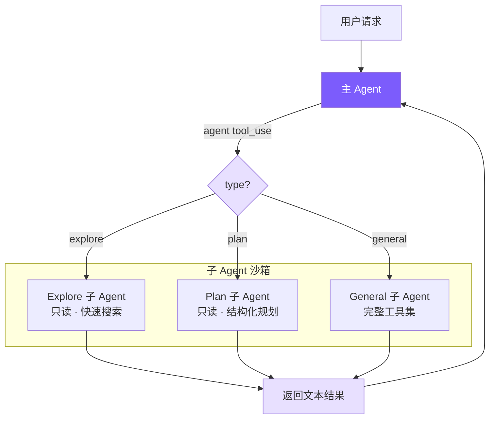
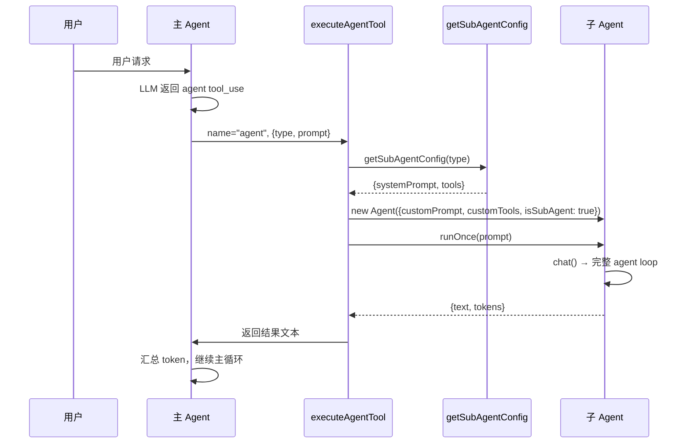
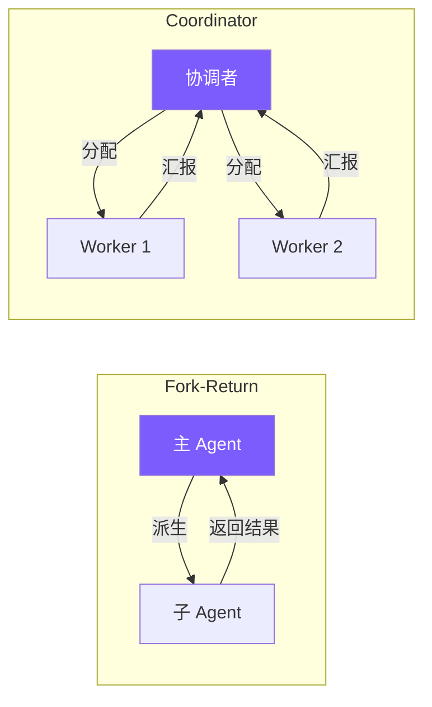

# 9. 多 Agent 架构

## 本章目标

实现 Sub-Agent（子代理）系统：让主 Agent 能派生出独立的子 Agent 执行探索、规划、通用任务，完成后将结果返回主 Agent。这是 Claude Code 处理复杂任务时最重要的"分而治之"机制。



## Claude Code 怎么做的

Claude Code 的多 Agent 体系在 `src/tools/AgentTool/` 中实现，是一个相当复杂的系统。

### 三种协作模型

Claude Code 支持三种 Agent 协作模式：

| 模式 | 模型 | 特点 |
|------|------|------|
| **Sub-Agent**（fork-return） | 分叉独立执行，完成后返回结果 | 我们实现的模式 |
| **Coordinator** | 一个协调者分配任务给多个 Agent | 需要任务队列 |
| **Swarm Team** | 多 Agent 对等协作 | 需要共享状态 |

其中 Sub-Agent 是最核心也是最常用的模式。

### 内置 Agent 类型

- **Explore**：使用 Haiku 模型（更快更便宜），只读工具集，专门用于代码搜索和探索
- **Plan**：只读 + 结构化输出，设计实现方案
- **General**：完整工具集（除了不能递归创建子 Agent）
- **Custom**：通过 `.claude/agents/*.md` 文件定义自定义 Agent 类型

### 5 阶段执行流程

AgentTool 的执行经过 5 个阶段：

1. **类型解析**：根据 `type` 参数确定 Agent 类型（内置 or 自定义）
2. **工具池过滤**：4 层过滤管道决定子 Agent 能用哪些工具
3. **System Prompt 构造**：每种类型有专用的系统提示词
4. **上下文创建**：deny-by-default，独立消息历史，可选缓存共享
5. **执行分支**：fork 子进程或内部调用，收集结果返回主 Agent

### 工具过滤：4 层管道

Claude Code 对子 Agent 的工具访问有严格的分层过滤：

```
ALL_AGENT_DISALLOWED     → 所有子 Agent 禁用的工具
CUSTOM_AGENT_DISALLOWED  → 自定义 Agent 额外禁用的工具
ASYNC_AGENT_ALLOWED      → 异步 Agent 特别允许的工具
agent-specific           → 特定类型的工具白名单
```

这种多层过滤确保子 Agent 只能访问其职责范围内的工具，是安全性的重要保障。

### 上下文隔离

Claude Code 的子 Agent 采用 **deny-by-default** 策略：

- 子 Agent 拥有独立的消息历史，不能看到主 Agent 的对话
- 子 Agent 的系统提示词由父 Agent 继承（优化 prompt cache 命中率）
- 子 Agent 的 token 消耗会汇总到父 Agent 的计费中

## 我们的实现

我们用 **~74 行** 的 `subagent.ts` + Agent 类的少量改动，实现了 Claude Code Sub-Agent 模式的核心。

### 整体架构



关键简化：

| Claude Code | 我们的实现 | 为什么可以简化 |
|-------------|-----------|--------------|
| 5 阶段执行流程 | 直接 new Agent + runOnce | 不需要 fork 进程、缓存共享 |
| 4 层工具过滤管道 | 1 个 Set + filter | 只有 3 种固定类型，不需要动态规则 |
| Haiku 模型给 Explore | 统一用主模型 | 简化配置，实际效果差别不大 |
| 自定义 Agent（`.md` 文件） | 不支持 | 3 种内置类型覆盖主要场景 |
| deny-by-default 上下文隔离 | 天然隔离（独立 Agent 实例） | new Agent 自带独立消息历史 |

## 关键代码

### 1. Agent 类型配置 — `subagent.ts`

这是整个子 Agent 系统的配置中心，定义了 3 种 Agent 类型的行为：

```typescript
// subagent.ts

export type SubAgentType = "explore" | "plan" | "general";

export interface SubAgentConfig {
  systemPrompt: string;
  tools: ToolDef[];
}

// 只读工具集 — explore 和 plan 共用
const READ_ONLY_TOOLS = new Set([
  "read_file", "list_files", "grep_search", "run_shell"
]);

function getReadOnlyTools(): ToolDef[] {
  return toolDefinitions.filter((t) => READ_ONLY_TOOLS.has(t.name));
}
```

为什么 `run_shell` 在"只读"工具集里？因为 shell 能执行 `git log`、`find`、`wc` 等强大的只读命令，完全禁止会大幅降低 explore 的能力。安全性通过 system prompt 中的约束来保证：

```typescript
const EXPLORE_PROMPT = `You are an Explore agent — a fast, READ-ONLY sub-agent...

IMPORTANT CONSTRAINTS:
- You are READ-ONLY. Do NOT modify any files.
- If using run_shell, only use read commands (ls, cat, find, grep, git log, etc.)
- Do NOT use write, edit, rm, mv, or any destructive shell commands.

Your job:
- Search files by patterns (list_files)
- Search code for keywords (grep_search)
- Read file contents (read_file)
- Run read-only shell commands (git log, git diff, find, etc.)

Be fast and thorough. Use multiple tool calls when possible.
Return a concise summary of your findings.`;
```

Plan Agent 同样只读，但 prompt 引导它输出结构化方案：

```typescript
const PLAN_PROMPT = `You are a Plan agent — a READ-ONLY sub-agent specialized for designing implementation plans.

IMPORTANT CONSTRAINTS:
- You are READ-ONLY. Do NOT modify any files.

Your job:
- Analyze the codebase to understand the current architecture
- Design a step-by-step implementation plan
- Identify critical files that need modification
- Consider architectural trade-offs

Return a structured plan with:
1. Summary of current state
2. Step-by-step implementation steps
3. Critical files for implementation
4. Potential risks or considerations`;
```

General Agent 最简单 — 拿到除 `agent` 外的全部工具：

```typescript
const GENERAL_PROMPT = `You are a General sub-agent handling an independent task.
Complete the assigned task and return a concise result. You have access to all tools.`;

export function getSubAgentConfig(type: SubAgentType): SubAgentConfig {
  switch (type) {
    case "explore":
      return { systemPrompt: EXPLORE_PROMPT, tools: getReadOnlyTools() };
    case "plan":
      return { systemPrompt: PLAN_PROMPT, tools: getReadOnlyTools() };
    case "general":
      // General agents get all tools except 'agent' (no recursive sub-agents)
      return {
        systemPrompt: GENERAL_PROMPT,
        tools: toolDefinitions.filter((t) => t.name !== "agent"),
      };
  }
}
```

### 2. Agent 工具定义 — `tools.ts`

`agent` 作为一个普通工具注册，与 `read_file`、`run_shell` 等并列：

```typescript
// tools.ts — agent 工具定义

{
  name: "agent",
  description:
    "Launch a sub-agent to handle a task autonomously. Sub-agents have isolated context " +
    "and return their result. Types: 'explore' (read-only, fast search), " +
    "'plan' (read-only, structured planning), 'general' (full tools).",
  input_schema: {
    type: "object",
    properties: {
      description: {
        type: "string",
        description: "Short (3-5 word) description of the sub-agent's task",
      },
      prompt: {
        type: "string",
        description: "Detailed task instructions for the sub-agent",
      },
      type: {
        type: "string",
        enum: ["explore", "plan", "general"],
        description: "Agent type: explore (read-only), plan (planning), general (full tools). Default: general",
      },
    },
    required: ["description", "prompt"],
  },
}
```

注意 `type` 不是 required — 默认回退到 `general`。这让 LLM 在不确定时可以不指定类型。

### 3. Agent 类改造 — `agent.ts`

Agent 类需要 4 处关键改动来支持子 Agent。

#### 3a. 构造函数：接受自定义配置

```typescript
// agent.ts — AgentOptions

interface AgentOptions {
  yolo?: boolean;
  model?: string;
  // ... 其他选项
  // Sub-agent 专用选项
  customSystemPrompt?: string;
  customTools?: ToolDef[];
  isSubAgent?: boolean;
}
```

构造函数中，子 Agent 使用自定义配置，主 Agent 使用默认值：

```typescript
constructor(options: AgentOptions = {}) {
  this.isSubAgent = options.isSubAgent || false;
  this.tools = options.customTools || toolDefinitions;     // 子 Agent 用受限工具集
  this.systemPrompt = options.customSystemPrompt || buildSystemPrompt(); // 子 Agent 用专用 prompt
  // ...
}
```

#### 3b. 输出捕获：emitText + outputBuffer

子 Agent 的文本输出不能直接打印到终端，需要收集起来返回给主 Agent：

```typescript
// 子 Agent 的输出缓冲区
private outputBuffer: string[] | null = null;

private emitText(text: string): void {
  if (this.outputBuffer) {
    this.outputBuffer.push(text);   // 子 Agent：收集到 buffer
  } else {
    printAssistantText(text);        // 主 Agent：直接打印
  }
}
```

这个设计很巧妙 — 同一个 `emitText` 方法，根据是否有 `outputBuffer` 自动切换行为。流式输出的回调里只需要调 `emitText`，完全不需要知道自己是主 Agent 还是子 Agent。

#### 3c. runOnce：一次性执行入口

```typescript
async runOnce(prompt: string): Promise<{ text: string; tokens: { input: number; output: number } }> {
  this.outputBuffer = [];                          // 开启输出捕获
  const prevInput = this.totalInputTokens;
  const prevOutput = this.totalOutputTokens;
  await this.chat(prompt);                         // 复用完整的 agent loop
  const text = this.outputBuffer.join("");          // 收集所有输出
  this.outputBuffer = null;                        // 关闭捕获
  return {
    text,
    tokens: {
      input: this.totalInputTokens - prevInput,    // 增量 token 统计
      output: this.totalOutputTokens - prevOutput,
    },
  };
}
```

`runOnce` 的核心思想：**子 Agent 复用主 Agent 完全相同的 agent loop**（`chat` 方法）。不需要写一套新的循环逻辑。区别只在于输出去向和工具集。

#### 3d. executeAgentTool：桥接主 Agent 和子 Agent

```typescript
private async executeAgentTool(input: Record<string, any>): Promise<string> {
  const type = (input.type || "general") as SubAgentType;
  const description = input.description || "sub-agent task";
  const prompt = input.prompt || "";

  printSubAgentStart(type, description);

  const config = getSubAgentConfig(type);
  const subAgent = new Agent({
    model: this.model,
    apiBase: this.useOpenAI ? this.openaiClient?.baseURL : undefined,
    customSystemPrompt: config.systemPrompt,
    customTools: config.tools,
    isSubAgent: true,
    yolo: true, // 子 Agent 不需要用户确认
  });

  try {
    const result = await subAgent.runOnce(prompt);
    // 将子 Agent 的 token 消耗汇总到父 Agent
    this.totalInputTokens += result.tokens.input;
    this.totalOutputTokens += result.tokens.output;
    printSubAgentEnd(type, description);
    return result.text || "(Sub-agent produced no output)";
  } catch (e: any) {
    printSubAgentEnd(type, description);
    return `Sub-agent error: ${e.message}`;
  }
}
```

在工具分发层，`agent` 工具被特殊处理（因为它需要访问 Agent 实例）：

```typescript
private async executeToolCall(name: string, input: Record<string, any>): Promise<string> {
  if (name === "agent") {
    return this.executeAgentTool(input);  // Agent 内部处理
  }
  return executeTool(name, input);         // 其他工具走通用分发
}
```

### 4. isSubAgent 标志的影响

子 Agent 运行时跳过一些只对主 Agent 有意义的操作：

```typescript
// chat() 结束时
if (!this.isSubAgent) {
  printDivider();    // 子 Agent 不打印分隔线
  this.autoSave();   // 子 Agent 不保存会话
}

// agent loop 内，响应结束后
if (!this.isSubAgent) {
  printCost(this.totalInputTokens, this.totalOutputTokens); // 子 Agent 不打印费用
}
```

### 5. 终端 UI — `ui.ts`

子 Agent 的开始和结束用缩进的边框标识，让用户清楚地看到子 Agent 的执行边界：

```typescript
export function printSubAgentStart(type: string, description: string) {
  console.log(chalk.magenta(`\n  ┌─ Sub-agent [${type}]: ${description}`));
}

export function printSubAgentEnd(type: string, description: string) {
  console.log(chalk.magenta(`  └─ Sub-agent [${type}] completed`));
}
```

## 关键设计决策

### 为什么用 fork-return 而不是其他模式？



Fork-return 是最简单也最安全的模式：

1. **无共享状态**：子 Agent 有独立的消息历史，不可能污染主 Agent 的上下文
2. **确定性**：主 Agent 发一个请求，等一个结果，控制流清晰
3. **容错简单**：子 Agent 出错，主 Agent 拿到错误信息继续工作
4. **Token 可追踪**：所有子 Agent 消耗直接汇总到父 Agent

### 为什么子 Agent 不能创建子 Agent？

General Agent 的工具列表里过滤掉了 `agent`：

```typescript
tools: toolDefinitions.filter((t) => t.name !== "agent")
```

这是一个关键的安全决策：

- **防止无限递归**：A 创建 B，B 创建 C，C 创建 D... 无限嵌套会耗尽资源
- **Token 爆炸**：每层子 Agent 都有自己的系统提示词和消息历史，嵌套几层就会消耗大量 token
- **调试困难**：多层嵌套的 Agent 调用链极难追踪和调试

Claude Code 也做了同样的限制。在实践中，1 层子 Agent 已经能覆盖绝大多数场景。

### 为什么子 Agent 设置 bypassPermissions？

```typescript
const subAgent = new Agent({
  // ...
  permissionMode: "bypassPermissions", // 子 Agent 不需要用户确认
});
```

子 Agent 跳过所有权限确认，原因是：

1. **用户体验**：主 Agent 已经被用户授权执行某个任务，子 Agent 再反复询问用户会中断工作流
2. **工具已受限**：explore 和 plan 只有只读工具，general 虽有写权限但这是用户主动选择的
3. **一致性**：Claude Code 的子 Agent 也是自动执行，不会中途询问用户

### 为什么 explore/plan 保留 run_shell？

看起来违反直觉 — "只读"的 Agent 怎么能执行 shell 命令？

但 shell 命令的读能力远比其他只读工具强大。`git log --oneline -20`、`find . -name "*.ts" | wc -l`、`cat package.json | jq .dependencies` 这些命令是代码探索的核心手段。如果去掉 shell，explore Agent 的能力会大打折扣。

安全性通过 **system prompt 约束** 来保证，而不是彻底禁止工具。这与 Claude Code 的做法一致 — 它的 explore Agent 也保留了受限的 BashTool。

### 为什么输出用 buffer 收集而不是回调？

```typescript
// 方案 A（我们的实现）：buffer 收集
private outputBuffer: string[] | null = null;
private emitText(text: string): void {
  if (this.outputBuffer) {
    this.outputBuffer.push(text);
  } else {
    printAssistantText(text);
  }
}

// 方案 B（回调方式）：
// constructor(options: { onText?: (text: string) => void })
// 每次输出时 this.options.onText?.(text)
```

选择 buffer 而不是回调的原因：

- **改动最小**：只在 `emitText` 一处判断，不需要修改 agent loop 的任何逻辑
- **结果完整性**：buffer 确保收集到子 Agent 的所有输出，不会因为异步回调丢失片段
- **生命周期清晰**：`runOnce` 开启 buffer → `chat` 写入 → `runOnce` 收集并关闭，边界明确

### 自定义 Agent 类型：`.claude/agents/*.md`

除了 3 种内置类型，用户可以通过 Markdown 文件定义自己的 Agent 类型——与 Claude Code 的 `.claude/agents/` 完全一致：

```markdown
<!-- .claude/agents/reviewer.md -->
---
name: reviewer
description: Reviews code for bugs and style issues
allowed-tools: read_file, list_files, grep_search, run_shell
---
You are a code reviewer. Analyze the code thoroughly and report:
1. Bugs and potential issues
2. Style inconsistencies
3. Performance concerns
```

**发现机制**：

```typescript
// subagent.ts — discoverCustomAgents

function discoverCustomAgents(): Map<string, CustomAgentDef> {
  const agents = new Map();
  // 用户级（低优先）
  loadAgentsFromDir(join(homedir(), ".claude", "agents"), agents);
  // 项目级（高优先，同名覆盖）
  loadAgentsFromDir(join(process.cwd(), ".claude", "agents"), agents);
  return agents;
}
```

**与内置类型的集成**：

```typescript
export function getSubAgentConfig(type: SubAgentType): SubAgentConfig {
  // 先查自定义 Agent
  const custom = discoverCustomAgents().get(type);
  if (custom) {
    const tools = custom.allowedTools
      ? toolDefinitions.filter(t => custom.allowedTools!.includes(t.name))
      : toolDefinitions.filter(t => t.name !== "agent");
    return { systemPrompt: custom.systemPrompt, tools };
  }
  // Fallback 到内置类型
  switch (type) { /* explore, plan, general */ }
}
```

frontmatter 复用 `parseFrontmatter()`（与 Memory 和 Skills 共享），用户学一套语法就能扩展三个系统。

### 总结：174 行实现的核心取舍

| 我们保留的 | 我们省略的 | 为什么 |
|-----------|-----------|--------|
| 3 种内置 + 自定义 Agent 类型 | plugin-provided Agent 类型 | 自定义文件覆盖绝大多数场景 |
| 只读工具集隔离 | 4 层工具过滤管道 | 固定类型 + 自定义 allowed-tools 够用 |
| 独立消息历史 | prompt cache 共享优化（fork 模式） | 独立 Agent 实例天然隔离 |
| Token 汇总到父 Agent | 子进程 fork 优化 | 单进程内创建即可 |
| 禁止递归创建子 Agent | Worktree 隔离 | 串行已够用，避免复杂度 |
| System prompt 约束安全 | AST 级命令分析 | Prompt 约束在实践中足够有效 |

这 174 行代码展示了一个重要的架构原则：**子 Agent 本质上就是一个配置不同的 Agent 实例**。通过给 Agent 类添加少量可选参数（`customTools`、`customSystemPrompt`、`isSubAgent`），我们让同一套 agent loop 同时服务于主 Agent 和子 Agent，避免了代码重复。自定义 Agent 类型让用户无需修改代码就能扩展系统——与 Claude Code 的扩展方式完全对齐。
