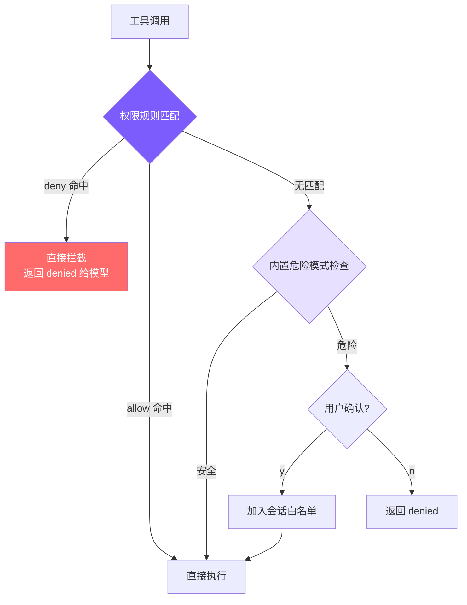

# 10. 权限规则系统

## 本章目标

在第 5 章的基础上，实现**可配置的权限规则系统**：用户通过配置文件预定义 allow/deny 规则，让 agent 自动放行安全操作、自动拦截危险操作，无需每次手动确认。



核心思路：**两层检查，deny 优先**。先查配置文件中的规则（Layer 1），无匹配再走内置危险模式检测（Layer 2）。这把第 5 章的"每次都问"升级为"按规则自动决策"。

## Claude Code 怎么做的

Claude Code 的权限系统是一套 **7 层纵深防御体系**：

```
Layer 1: Trust Dialog         — 工作区信任确认
Layer 2: Permission Modes     — 5 种权限模式（default/plan/acceptEdits/bypass/dontAsk）
Layer 3: Permission Rules     — allow/deny/ask 规则匹配
Layer 4: Bash Safety          — tree-sitter AST 解析 + 23 项静态检查
Layer 5: Tool-Level Safety    — 每个工具独立的 validateInput/checkPermissions
Layer 6: Sandbox              — 操作系统级进程隔离
Layer 7: User Confirmation    — 交互式确认 + ML 分类器竞速
```

其中**权限规则系统**（Layer 3）的复杂度远超我们的实现：

### 8 种规则来源，严格优先级

| 优先级 | 来源 | 说明 |
|--------|------|------|
| 1 | `policySettings` | 企业 MDM 策略（不可覆盖） |
| 2 | `userSettings` | `~/.claude/settings.json` |
| 3 | `projectSettings` | `.claude/settings.json`（提交到仓库） |
| 4 | `localSettings` | `.claude/settings.local.json`（不提交） |
| 5 | `flagSettings` | CLI 启动参数 |
| 6 | `cliArg` | API/SDK 传入 |
| 7 | `command` | 自定义命令定义 |
| 8 | `session` | 用户在对话中"始终允许"生成 |

### 3 种匹配类型

- **精确匹配**：`Bash(npm install)` 只匹配 `npm install`
- **前缀匹配**：`Bash(npm:*)` 匹配 `npm`、`npm install`、`npm run build`
- **通配符匹配**：`Bash(git * --no-verify)` 匹配 `git commit --no-verify`、`git push --no-verify`

### 3 种规则行为

除了 `allow` 和 `deny`，Claude Code 还有 **`ask`** 规则——强制弹出确认对话框，**即使在 bypassPermissions 模式下也生效**。这是给高危操作（如 `npm publish`、`git push --force`）设置的"安全阀"。

### Bypass-Immune 检查

某些安全检查无论什么模式都不能跳过：编辑 `.git/`、`.bashrc`、`.claude/settings.json` 等敏感路径时，即使用户开了 bypass 模式也必须确认。

### Permission Explainer

当需要用户确认时，Claude Code 会用 Haiku 模型调用 `sideQuery` 生成一段人类可读的风险解释——不是简单地显示"dangerous command: rm -rf /"，而是解释"这个命令会递归删除根目录下的所有文件"。

完整实现在 `src/utils/permissions/permissions.ts`，**52KB 一个文件**。

## 我们的实现

我们把 7 层简化为 **2 层**，把 8 种规则来源简化为 **2 种**（用户级 + 项目级），把 3 种规则行为简化为 **2 种**（allow + deny）。够用了。

### 配置文件格式

```json
// ~/.claude/settings.json（用户级，全局生效）
{
  "permissions": {
    "allow": [
      "read_file",
      "list_files",
      "grep_search",
      "run_shell(npm test*)",
      "run_shell(git status)",
      "run_shell(git diff*)"
    ],
    "deny": [
      "run_shell(rm -rf*)",
      "run_shell(git push --force*)"
    ]
  }
}
```

```json
// .claude/settings.json（项目级，提交到仓库）
{
  "permissions": {
    "allow": [
      "run_shell(npm run build)"
    ],
    "deny": [
      "run_shell(curl*)"
    ]
  }
}
```

用户级规则 + 项目级规则合并后一起生效。规则格式：

- `"read_file"` — 匹配该工具的所有调用
- `"run_shell(npm test*)"` — 匹配 `run_shell` 中命令以 `npm test` 开头的调用

## 关键代码

### 1. 规则解析：ParsedRule

```typescript
// tools.ts — 规则类型与解析

interface ParsedRule {
  tool: string;
  pattern: string | null;  // null 表示匹配该工具所有调用
}

function parseRule(rule: string): ParsedRule {
  const match = rule.match(/^([a-z_]+)\((.+)\)$/);
  if (match) {
    return { tool: match[1], pattern: match[2] };
  }
  return { tool: rule, pattern: null };
}
```

解析逻辑很简单：正则提取 `toolName(pattern)` 格式，没有括号的就是匹配所有调用。

```
parseRule("read_file")              → { tool: "read_file",  pattern: null }
parseRule("run_shell(npm test*)")   → { tool: "run_shell",  pattern: "npm test*" }
parseRule("run_shell(rm -rf*)")     → { tool: "run_shell",  pattern: "rm -rf*" }
```

### 2. 加载规则：两级配置合并

```typescript
// tools.ts — 加载权限规则

let cachedRules: PermissionRules | null = null;

export function loadPermissionRules(): PermissionRules {
  if (cachedRules) return cachedRules;

  const allow: ParsedRule[] = [];
  const deny: ParsedRule[] = [];

  // 先加载用户级（~/.claude/settings.json）
  const userSettings = loadSettings(
    join(homedir(), ".claude", "settings.json")
  );
  // 再加载项目级（.claude/settings.json）
  const projectSettings = loadSettings(
    join(process.cwd(), ".claude", "settings.json")
  );

  for (const settings of [userSettings, projectSettings]) {
    if (!settings?.permissions) continue;
    if (Array.isArray(settings.permissions.allow)) {
      for (const r of settings.permissions.allow) allow.push(parseRule(r));
    }
    if (Array.isArray(settings.permissions.deny)) {
      for (const r of settings.permissions.deny) deny.push(parseRule(r));
    }
  }

  cachedRules = { allow, deny };
  return cachedRules;
}
```

设计要点：

- **缓存**：配置只加载一次，后续调用直接返回。避免每次工具调用都读文件。
- **合并而非覆盖**：项目级规则**追加**到用户级规则后面，两者都生效。这意味着你可以在用户级设置通用规则（如允许所有读操作），在项目级设置项目特有规则（如允许该项目的构建命令）。
- **没有优先级区分**：与 Claude Code 的 8 级优先级不同，我们把所有 deny 规则视为同等优先，所有 allow 规则也是。简单够用。

### 3. 规则匹配：matchesRule

```typescript
// tools.ts — 规则匹配

function matchesRule(
  rule: ParsedRule,
  toolName: string,
  input: Record<string, any>
): boolean {
  if (rule.tool !== toolName) return false;
  if (!rule.pattern) return true;  // 无 pattern → 匹配该工具所有调用

  // 取出要匹配的值
  let value = "";
  if (toolName === "run_shell") value = input.command || "";
  else if (input.file_path) value = input.file_path;
  else return true;  // 没有具体值可匹配，工具名匹配就够了

  const pattern = rule.pattern;
  // 通配符：pattern 以 * 结尾 → 前缀匹配
  if (pattern.endsWith("*")) {
    return value.startsWith(pattern.slice(0, -1));
  }
  return value === pattern;  // 精确匹配
}
```

匹配逻辑分三层：

1. **工具名不匹配** → 直接跳过
2. **无 pattern** → 匹配该工具所有调用（如 `"read_file"` 匹配所有文件读取）
3. **有 pattern** → 对 `run_shell` 匹配 `command`，对文件工具匹配 `file_path`

通配符只支持尾部 `*`（前缀匹配）。Claude Code 支持任意位置的 `*` 和 `:*` 前缀语法，我们只保留最常用的尾部通配符。

```
规则: run_shell(npm test*)
  "npm test"           → true  （前缀匹配）
  "npm test --watch"   → true  （前缀匹配）
  "npm install"        → false （前缀不匹配）

规则: run_shell(git status)
  "git status"         → true  （精确匹配）
  "git status -s"      → false （精确匹配要求完全一致）
```

### 4. 检查规则：deny 优先

```typescript
// tools.ts — 规则检查

function checkPermissionRules(
  toolName: string,
  input: Record<string, any>
): "allow" | "deny" | null {
  const rules = loadPermissionRules();

  // deny 规则先检查（优先级更高）
  for (const rule of rules.deny) {
    if (matchesRule(rule, toolName, input)) return "deny";
  }
  // 然后 allow 规则
  for (const rule of rules.allow) {
    if (matchesRule(rule, toolName, input)) return "allow";
  }
  return null;  // 无匹配规则，交给下一层处理
}
```

**deny 优先**是安全系统的核心原则。即使你在 allow 中写了 `"run_shell"`（允许所有 shell 命令），deny 中的 `"run_shell(rm -rf*)"` 仍然会生效。这让用户可以先设置宽泛的 allow，再用 deny 排除特定危险操作。

### 5. 统一入口：checkPermission

```typescript
// tools.ts — 统一权限检查

export function checkPermission(
  toolName: string,
  input: Record<string, any>
): { action: "allow" | "deny" | "confirm"; message?: string } {
  // Layer 1: 检查配置文件中的权限规则
  const ruleResult = checkPermissionRules(toolName, input);
  if (ruleResult === "deny") {
    return { action: "deny", message: `Denied by permission rule for ${toolName}` };
  }
  if (ruleResult === "allow") {
    return { action: "allow" };
  }

  // Layer 2: 无匹配规则时，走内置危险模式检查
  if (toolName === "run_shell" && isDangerous(input.command)) {
    return { action: "confirm", message: input.command };
  }
  if (toolName === "write_file" && !existsSync(input.file_path)) {
    return { action: "confirm", message: `write new file: ${input.file_path}` };
  }
  if (toolName === "edit_file" && !existsSync(input.file_path)) {
    return { action: "confirm", message: `edit non-existent file: ${input.file_path}` };
  }

  return { action: "allow" };
}
```

这个函数替代了第 5 章的 `needsConfirmation`，返回三种动作：

- **`allow`**：直接执行，不问用户
- **`deny`**：直接拦截，将 denied 消息返回给模型
- **`confirm`**：弹出确认对话框（和第 5 章的行为一致）

`needsConfirmation` 保留为兼容包装器：

```typescript
export function needsConfirmation(
  toolName: string,
  input: Record<string, any>
): string | null {
  const result = checkPermission(toolName, input);
  if (result.action === "confirm") return result.message || null;
  return null;
}
```

### 6. Agent Loop 集成

在 `agent.ts` 中，两个后端（Anthropic 和 OpenAI）使用相同的权限检查逻辑：

```typescript
// agent.ts — Anthropic 后端的权限检查

// permissionMode 为 "bypassPermissions"（--yolo）时跳过全部检查
const perm = checkPermission(toolUse.name, input, this.permissionMode);

if (perm.action === "deny") {
  // 规则拦截：告诉模型这个操作被拒绝了
  printInfo(`Denied: ${perm.message}`);
  toolResults.push({
    type: "tool_result",
    tool_use_id: toolUse.id,
    content: `Action denied by permission rules: ${perm.message}`,
  });
  continue;  // 跳过这个工具，继续处理下一个
}

if (perm.action === "confirm" && perm.message
    && !this.confirmedPaths.has(perm.message)) {
  // 需要用户确认
  const confirmed = await this.confirmDangerous(perm.message);
  if (!confirmed) {
    toolResults.push({
      type: "tool_result",
      tool_use_id: toolUse.id,
      content: "User denied this action.",
    });
    continue;
  }
  this.confirmedPaths.add(perm.message);  // 记住授权
}
```

关键设计：

- **deny 不弹对话框**：直接拦截，用户无法覆盖（要想放行，去改配置文件）
- **deny 消息返回给模型**：模型看到 "Action denied by permission rules" 后会调整策略，比如换一种更安全的方式
- **confirm 仍走会话白名单**：用户确认一次后，`confirmedPaths` 记住，同一操作不再重复询问
- **`--yolo` 跳过全部**：`permissionMode === "bypassPermissions"` 时直接绕过所有检查

## 关键设计决策

### 为什么是 2 层而不是 7 层？

Claude Code 的 7 层纵深防御服务于一个前提：**它在数百万用户的真实生产环境中运行**。Trust Dialog 防恶意仓库、AST 解析防命令注入、Sandbox 防进程逃逸、ML 分类器减少用户打扰。

我们的 2 层足以覆盖个人使用场景：
- **Layer 1（规则）**：解决"每次都问太烦"的问题——把常用安全操作加入 allow
- **Layer 2（内置检查）**：兜底防护——16 个正则捕获最常见的危险命令（含 6 个 Windows 专用）

| 维度 | Claude Code | mini-claude |
|------|------------|-------------|
| **防御层数** | 7 层 | 2 层 |
| **规则来源** | 8 种，严格优先级 | 2 种（用户 + 项目），合并 |
| **规则行为** | allow / deny / ask | allow / deny |
| **匹配方式** | 精确 / 前缀 / 通配符 | 精确 / 尾部通配符 |
| **命令分析** | tree-sitter AST | 正则匹配 |
| **Bypass-Immune** | 敏感路径强制确认 | 无 |
| **Permission Explainer** | Haiku 生成风险解释 | 显示原始命令 |
| **代码量** | ~52KB | ~120 行新增 |

### 为什么 deny 优先于 allow？

安全系统的第一原则：**黑名单优先于白名单**。如果 allow 优先，用户写了 `allow: ["run_shell"]` 后就无法用 deny 排除特定危险命令。deny 优先让用户可以"先放开，再收紧"：

```json
{
  "permissions": {
    "allow": ["run_shell(git *)"],
    "deny": ["run_shell(git push --force*)"]
  }
}
```

这个配置的含义是：允许所有 git 命令，**但** force push 除外。如果 allow 优先，deny 规则永远不会被检查到。

### 为什么配置文件而不是命令行参数？

配置文件有两个优势：

1. **可分享**：项目级 `.claude/settings.json` 可以提交到仓库，团队成员共享同一套规则
2. **持久化**：不需要每次启动都传参数

Claude Code 的 8 种来源覆盖了从"企业强制策略"到"会话临时规则"的所有场景。我们只保留了最实用的 2 种。

### 为什么缓存规则？

`loadPermissionRules` 使用 `cachedRules` 避免重复读取文件。一个 agent 会话中可能有几十上百次工具调用，每次都读磁盘是浪费。缓存的代价是修改配置文件后需要重启 agent——对于个人工具来说完全可接受。

### 为什么没有 ask 规则？

Claude Code 的 `ask` 规则是给 `bypassPermissions` 模式用的安全阀——"即使我开了全自动，这几个操作还是要问我"。我们没有 bypass 模式（只有 `--yolo`），而 `--yolo` 的语义就是"我完全信任你"，加 ask 规则会破坏这个语义。如果需要 ask 的效果，不把那个操作加入 allow 就行了——它自然会走到 Layer 2 的内置检查。

---

> **这一章为第 5 章的安全机制增加了可配置性**。从"写死的规则"进化到"用户定义规则"，是从个人工具到团队工具的关键一步。Claude Code 的 7 层体系告诉我们上限在哪里，而 2 层实现告诉我们下限可以多简单。
